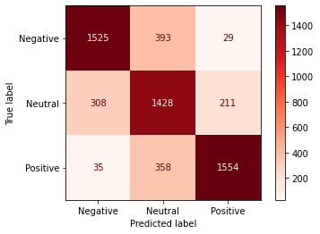

<!-- Add banner here -->

# Reviews Pundit
This is a web application that analyzes(classifies) single/many input customer reviews sentiment, with an extra functionality to filter out `fake(spam)` reviews.  
The application can be accessed [**here**](https://reviewspundit.herokuapp.com/).
# Demo-Preview

# Table of contents
- [Project Title](#reviews-pundit)
- [Demo-Preview](#demo-preview)
- [Usage](#usage)
- [Development](#development)
- [Contribute](#contribute)
# Usage
This [**Sentiment Analyzer**](https://reviewspundit.herokuapp.com/) application expects the input file containing multiple customer reviews to be a `CSV` file with the review texts stored in a column named `'review'`.  
> **_NOTE:_**  For Demo purposes, this application provides a sample dataset of 100 Amazon products(PCs) review's from [**TensorFlow Datasets**](https://www.tensorflow.org/datasets/catalog/amazon_us_reviews#amazon_us_reviewspc_v1_00).
# Development
- ### Model Development
  - #### Data Collection
  I used a dataset consisting of reviews of Amazon `mobile electronic` products in US marketplace, from [**TensorFlow Datasets**](https://www.tensorflow.org/datasets/catalog/amazon_us_reviews#amazon_us_reviewsmobile_electronics_v1_00).
  - #### Data Pre-processing
  Using the `star-ratings` associated to each product review; I annotated my dataset, creating a `sentiment` column, with `Negative` sentiment associated to reviews with 2 stars or less, `Neutral` sentiment associated to reviews with exactly 3 starts, and `Positive` sentiment associated to reviews with either 4 or 5 stars.
   
  In addition, I balanced the dataset, and kept `29202` annotated reviews in total, corresponding to `9734` reviews for each sentiment category.  
  Thereafter, before applying classic ML models, I normalized the review texts using the `NLTK` package by removing non-alphabetic words/characters, removing english stop-words, and lemmatization.
  - #### Feature Extraction
  Given that I wanted to use Hugging Face's pre-trained transformers like `DistilBert` due to its simplicity as well as cheap cost, I tokenized the reviews with the `'distilbert-base-uncased'` tokenizer. Nevertheless, I later used the `CountVectorizer` for classic ML models.
  - #### Benchmarking
    - I first loaded a pre-trained TensorFlow `'distilbert-base-uncased'` model, and using `60%` of the dataset for `training`, `20%` for `cross-validation`, and `20%` for `testing`, I fit the model with 2 epochs, resulting in an overall `77.16%` accuracy score.   
         
      **Confusion Matrix**   
      

    -  Thereafter, I used classical ML models with features generated by the `CountVectorizer`, starting with Logistic Regression.  
       Using `80%` of the dataset for training and `20%` for testing, I fit a multinomial Logistic Regression model and Cross-validated it with L2 regularization.
       The accuracy score of the the Logistic Regression model was `67.22%`.   
       **Confusion Matrix**   
        
    - Next, I fitted a Multinomial NaiveBayes model, resulting in a `66.18%` accuracy score.   
      **Confusion Matrix**   
      
    - Finally, considering how good are Hugging Face transformes in Transfer Learning, I used the `DistilBert` model trained in step 1 to predict the reviews'           sentiment on a new dataset consisting of reviews of Amazon `PC` products in US marketplace, from 
      [**TensorFlow Datasets**](https://www.tensorflow.org/datasets/catalog/amazon_us_reviews#amazon_us_reviewspc_v1_00).   
      Using a random sample of `6000` product reviews, the model testing resulted in an accuracy score of `80.65%`, with an `f1-score` of `88%` for `Positive`           reviews, `85%` for `Negative` reviews, and `46%` for `Neutral` reviews; highlighting the models'  struggle to classify accurately `Neutral` reviews overall.
         
      **Confusion Matrix**   
         
> **_NOTE:_** I exported the model with the best performance(the **DistilBert** model), and deployed it with a Django API that I developed [here](https://github.com/CaesarJules/Django_api).
- ### Application Development and Model Deployment
  - #### Front End
    - I used the [streamlit](https://streamlit.io/) framework for its simplicity in developing data apps.
  - #### Back End
    - I deployed the pre-trained model with a Django API that I developed, and hosted on an **AWS** EC2 instance.

# Contribute
For any suggestion or feedback, please feel free to reach out to me via [email](mailto:njucesar@gmail.com).
# License
[(Back to top)](#reviews-pundit)

All the code is open source, feel free to integrate it in your projects!

[GNU General Public License version 3](https://opensource.org/licenses/GPL-3.0)
